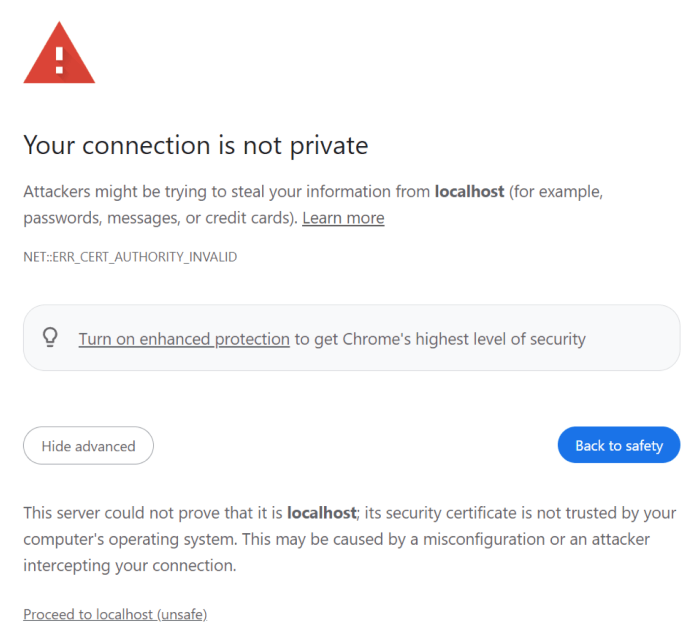

Neuropunk Beta

## Table of Contents

- [Table of Contents](#table-of-contents)
- [Install Dependencies](#install-dependencies)
- [Scripts](#scripts)
- [Create Bot and Mini App](#create-bot-and-mini-app)
- [Run](#run)
  - [Run Inside Telegram](#run-inside-telegram)
- [Deploy](#deploy)
- [Supabase](#supabase)
- [Environment Variables](#environment-variables)
  - [Core Configuration](#core-configuration)
  - [Authentication Configuration](#authentication-configuration)
  - [Telegram Bot Configuration](#telegram-bot-configuration)
  - [Supabase Configuration](#supabase-configuration)
  - [Sentry Configuration](#sentry-configuration)
  - [Eruda Debugging Configuration](#eruda-debugging-configuration)
  - [Notes](#notes)
- [Example `.env` File](#example-env-file)
- [Useful Links](#useful-links)

This template demonstrates how developers can implement a web application on the
Telegram Mini Apps platform using the following technologies and libraries:

- [Next.js](https://nextjs.org/)
- [TypeScript](https://www.typescriptlang.org/)
- [TON Connect](https://docs.ton.org/develop/dapps/ton-connect/overview)
- [@telegram-apps SDK](https://docs.telegram-mini-apps.com/packages/telegram-apps-sdk/2-x)
- [Telegram UI](https://github.com/Telegram-Mini-Apps/TelegramUI)

> The template was created using [pnpm](https://pnpm.io/). Therefore, it is
> required to use it for this project as well. Using other package managers, you
> will receive a corresponding error.

## Install Dependencies

If you have just cloned this template, you should install the project
dependencies using the command:

```Bash
pnpm install
```

## Scripts

This project contains the following scripts:

- `dev`. Runs the application in development mode.
- `dev:https`. Runs the application in development mode using self-signed SSL
  certificate.
- `build`. Builds the application for production.
- `start`. Starts the Next.js server in production mode.
- `lint`. Runs [eslint](https://eslint.org/) to ensure the code quality meets
  the required
  standards.
- `supabase:db-seed`. Updates `supabase/seed.sql` file from `seed.ts`
- `supabase:generate-database-types`. Generate TypeScript types for the database into `src/types/database-generated.types.ts`

To run a script, use the `pnpm run` command:

```Bash
pnpm run {script}
# Example: pnpm run build
```

## Create Bot and Mini App

Before you start, make sure you have already created a Telegram Bot. Here is
a [comprehensive guide](https://docs.telegram-mini-apps.com/platform/creating-new-app)
on how to do it.

## Run

Although Mini Apps are designed to be opened
within [Telegram applications](https://docs.telegram-mini-apps.com/platform/about#supported-applications),
you can still develop and test them outside of Telegram during the development
process.

To run the application in the development mode for `localhost`, use the `dev:https` script:

```bash
pnpm run dev:https
```

To run the application in the development mode with **`ngrok`**, use the `dev` script:

```bash
pnpm run dev
```

**NB! After implementing NextAuth it is impossible to pass the loading screen using `http` protocol, only `https`**

After this, you will see a similar message in your terminal:

```bash
▲ Next.js 14.2.3
- Local:        http://localhost:3000

✓ Starting...
✓ Ready in 2.9s
```

To view the application, you need to open the `Local`
link (`http://localhost:3000` in this example) in your browser.

It is important to note that some libraries in this template, such as
`@telegram-apps/sdk`, are not intended for use outside of Telegram.

Nevertheless, they appear to function properly. This is because the
`src/hooks/useTelegramMock.ts` file, which is imported in the application's
`Root` component, employs the `mockTelegramEnv` function to simulate the
Telegram environment. This trick convinces the application that it is
running in a Telegram-based environment. Therefore, be cautious not to use this
function in production mode unless you fully understand its implications.

### Run Inside Telegram

Although it is possible to run the application outside of Telegram, it is
recommended to develop it within Telegram for the most accurate representation
of its real-world functionality.

To run the application inside Telegram, [@BotFather](https://t.me/botfather)
requires an HTTPS link.

This template already provides a solution.

To retrieve a link with the HTTPS protocol, consider using the `dev:https`
script:

```bash
$ pnpm run dev:https

▲ Next.js 14.2.3
- Local:        https://localhost:3000

✓ Starting...
✓ Ready in 2.4s
```

Visiting the `Local` link (`https://localhost:3000` in this example) in your
browser, you will see the following warning:



This browser warning is normal and can be safely ignored as long as the site is
secure. Click the `Proceed to localhost (unsafe)` button to continue and view
the application.

Once the application is displayed correctly, submit the
link `https://127.0.0.1:3000` (`https://localhost:3000` is considered as invalid
by BotFather) as the Mini App link to [@BotFather](https://t.me/botfather).
Then, navigate to [https://web.telegram.org/k/](https://web.telegram.org/k/),
find your bot, and launch the Telegram Mini App. This approach provides the full
development experience.

## Deploy

The easiest way to deploy your Next.js app is to use
the [Vercel Platform](https://vercel.com/new?utm_medium=default-template&filter=next.js&utm_source=create-next-app&utm_campaign=create-next-app-readme)
from the creators of Next.js.

Check out
the [Next.js deployment documentation](https://nextjs.org/docs/deployment) for
more details.

## Supabase
1. Start the Supabase local environment:\
`pnpm supabase start` \
This spins up the Supabase services (e.g., PostgreSQL, API) locally in Docker containers, allowing you to develop with a local Supabase instance.

2. Reset the Supabase database: \
`supabase db reset` \
This clears your local database, dropping all tables and recreating the database structure as defined in your project’s migrations.

3. Sync Snaplet seed data: \
`npx @snaplet/seed sync` \
This command pulls or syncs seed data using Snaplet, a tool for managing seeded database data in development.

4. Generate a SQL seed file: \
`npx supabase:db-seed` \
This runs the TypeScript `seed.ts `script and outputs the result as SQL commands into `supabase/seed.sql`. This file will contain the data seeding logic for initializing your database.

5. Reset and apply seed data to the database again: \
`supabase db reset` \
Running `supabase db reset` again will reset the database, and it will use the newly generated seed file from the previous command to populate your database tables with the seed data.

6. Generate TypeScript types from your Supabase schema: \
`npx supabase:generate-database-types` \
This command uses the Supabase CLI to generate TypeScript types from your database schema, based on the projectId of your Supabase project (`SUPABASE_PROJECT_ID` in .env file). The generated types are saved to `src/types/database-generated.types.ts`, making it easier to work with your Supabase data in a type-safe way.

## Environment Variables

### Core Configuration

- **`NODE_ENV`**  
  - **Description**: Specifies the environment in which the application is running.
  - **Options**: `development`, `production`, or `test`
  - **Usage**: Sets `env.env` to the current environment and `env.isProduction` to `true` when `NODE_ENV` is set to `production`.

- **`NEXT_PUBLIC_SITE_URL`**  
  - **Description**: Defines the base URL of the site.
  - **Usage**: `env.siteUrl` uses this value. If not set, the app falls back to the `VERCEL_URL` environment variable (if available).

- **`VERCEL_URL`**  
  - **Description**: Automatically populated by Vercel deployments; provides the URL of the deployed application.
  - **Usage**: Used as a fallback for `env.siteUrl` when `NEXT_PUBLIC_SITE_URL` is not specified.

### Authentication Configuration

- **`AUTH_URL`**  
  - **Description**: Specifies the URL for the authentication service.
  - **Usage**: Used in `env.auth.url`.

- **`AUTH_SECRET`**  
  - **Description**: Secret key for authentication. Ensure this is kept secure and not shared.
  - **Usage**: Used in `env.auth.secret`.

### Telegram Bot Configuration

- **`TG_BOT_TOKEN`**  
  - **Description**: Token for the Telegram bot used in the application.
  - **Usage**: Stored in `env.telegram.botToken` to interact with Telegram's API.

- **`TG_USER_VALIDATION_DISABLED`**  
  - **Description**: A flag to disable user validation within the Telegram bot.
  - **Options**: `"true"` to disable validation; any other value or absence defaults to validation being enabled.
  - **Usage**: Parsed as a boolean (`env.telegram.userValidationDisabled`) to control validation behavior.

### Supabase Configuration

- **`NEXT_PUBLIC_SUPABASE_URL`**  
  - **Description**: URL for connecting to your Supabase instance.
  - **Usage**: Stored in `env.supabase.url` and used for Supabase API calls.

- **`NEXT_PUBLIC_SUPABASE_ANON_KEY`**  
  - **Description**: Public API key for Supabase, used for client-side connections.
  - **Usage**: Stored in `env.supabase.anonKey`.

### Sentry Configuration

- **`SENTRY_DSN`**  
  - **Description**: Data Source Name for Sentry, which is required to connect your application to Sentry for error tracking.
  - **Usage**: Used to configure Sentry for error monitoring and reporting.

- **`SENTRY_AUTH_TOKEN`**  
  - **Description**: Authentication token for Sentry, used for deployment tracking and other integrations.
  - **Usage**: Stored securely and used when authenticating API calls to Sentry.

### Eruda Debugging Configuration

- **`NEXT_PUBLIC_ERUDA_DISABLED`**  
  - **Description**: Controls whether the Eruda debugging tool is enabled. Eruda is typically used for debugging on mobile browsers.
  Options: "true" to disable Eruda; any other value or absence defaults to Eruda being enabled.
  - **Usage**: Can be used in development to toggle mobile debugging features on or off.

### Notes

- Variables prefixed with `NEXT_PUBLIC_` are accessible on both the client and server. 
- Secret keys such as `AUTH_SECRET` and `TG_BOT_TOKEN` should not be shared or exposed on the client side.
- Ensure that sensitive environment variables are set in your server environment (e.g., Vercel, .env file in local development).

## Example `.env` File

```dotenv
NODE_ENV=development
NEXT_PUBLIC_SITE_URL=https://your-site-url.com
AUTH_URL=https://auth-service-url.com
AUTH_SECRET=your-auth-secret
TG_BOT_TOKEN=your-telegram-bot-token
TG_USER_VALIDATION_DISABLED=true
NEXT_PUBLIC_SUPABASE_URL=https://your-supabase-url.supabase.co
NEXT_PUBLIC_SUPABASE_ANON_KEY=your-supabase-anon-key
```

By setting up these environment variables correctly, you can configure the application to behave appropriately across different environments.

## Useful Links

- [Platform documentation](https://docs.telegram-mini-apps.com/)
- [@telegram-apps/sdk-react documentation](https://docs.telegram-mini-apps.com/packages/telegram-apps-sdk-react)
- [Telegram developers community chat](https://t.me/devs)
- 